# Laporan Modul 1: Perkenalan Java dan Ekosistemnya
**Mata Kuliah:** Praktikum DESIGN PATTERN   
**Nama:** Fathan Al Ghifari  
**NIM:** 2024573010091  
**Kelas:** TI 2A

---

## Abstrak
pada laporan pratikum kali ini bertujuan untuk meReview Dasar Pemrograman Java agar nantinya dapat melakukan pratikum design pattern dengan baik


---

## 1. Pengenalan Java dan Lingkungan Pengembangan
Java dipilih sebagai bahasa pemrograman dalam mata kuliah ini karena berbagai keunggulan yang dimilikinya. Platform independence merupakan fitur unggulan Java dengan konsep "Write once, run anywhere" yang memungkinkan program Java yang telah dikompilasi dapat dijalankan di berbagai sistem operasi tanpa perlu modifikasi kode. Java juga merupakan strongly typed language yang mengurangi kemungkinan error saat runtime karena sistem type checking yang ketat pada saat kompilasi.

## langkah pratikum:
1. Pastikan JDK dan Intellij IDE Community Edition sudah terinstal. Jika belum, kunjungi url berikut untuk mengunduh JDK Amazon Correto dan Intellij
2. Buka IDE dan buat sebuah project baru dengan ketentuan seperti berikut:
```declarative
Name: ti_design_pattern
Location: disesuaikan
Build system: Intellij
JDK: Amazon Correto
Hilangkan centang pada bagian add sample code
```  

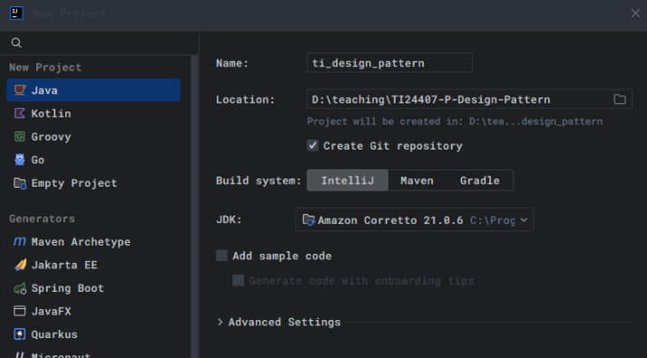   

3. Buat sebuah package baru di dalam folder src dengan cara klik kanan pada folder src kemudian pilih New -> Package. Beri nama modul_1.
4. Buat Sebuah class didalam package modul_1 dengan cara klik kanan dan pilih New -> Java Class. Beri nama HelloWorld
5. Isikan kode dibawah ini.  
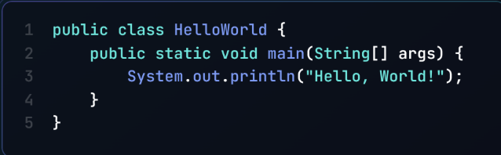  
6. Jalankan program dengan menekan tombol segitiga hijau seperti ditunjukkan pada lingkaran biru pada gambar dibawah ini.
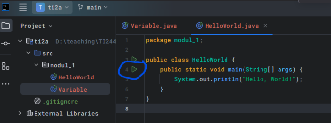  
output:  
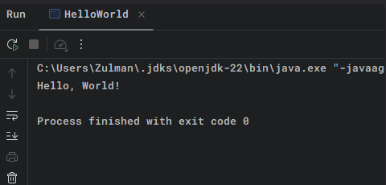  
---

## 2. Variabel dan Tipe Data
Variabel digunakan untuk menyimpan data dalam program. Setiap variabel memiliki tipe data yang menentukan jenis nilai yang dapat disimpan. Tipe data dasar di Java:
1. int: Bilangan bulat (contoh: 10, -5)
2.   double: Bilangan desimal (contoh: 3.14, -0.5)
3.   boolean: Nilai true atau false
4.   char: Karakter tunggal (contoh: 'A', '1')
5.   String: Teks (contoh: "Hello")
## langkah pratikum:
1. Buat sebuah class baru di dalam package `modul_1` dan beri nama `Variable`
2. Tuliskan kode berikut:  
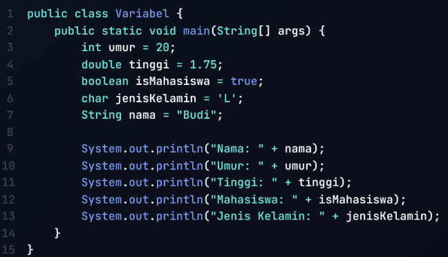  
3. Jalankan program nya untuk melihat hasil.  
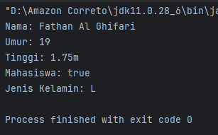  

## latihan:
Buatlah program untuk menampilkan data diri anda yang lengkap dengan attribut seperti berikut:
```declarative
Nama Lengkap, Tempat Lahir, Tanggal Lahir, Golongan Darah, Umur, 
Tinggi Badan, Jenis Kelamin, Agama, Pekerjaan.
```
hasil:  
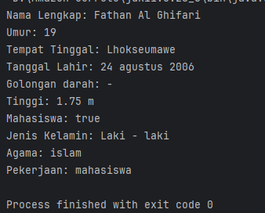  


---

## 3. Operator dan Expressi 
Operator digunakan untuk melakukan operasi pada variabel dan nilai. Jenis operator:
1. Aritmatika: `+, -, *, /, %`
2. Perbandingan: `==, !=, >, <, >=, <=`
3. Logika: `&& (AND), || (OR), ! (NOT)`
## langkah pratikum:
1. Buat sebuah class baru di dalam package `modul_1` dan beri nama `Operator`
2. Tuliskan kode berikut:  
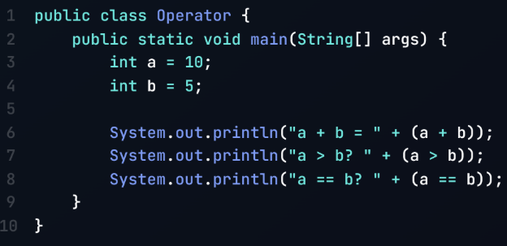    
3. Jalankan program nya untuk melihat hasil.
hasil nya:  
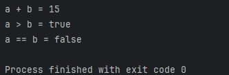  

## latihan  
Buat program untuk menghitung luas persegi panjang (panjang * lebar)
```declarative
package pratikum_1.latihan;

public class LatihanOperator {
    public static void main(String[] args){
        int panjang = 3;
        int lebar = 7;

        System.out.println("luas persegi panjang = " + (panjang*lebar));
    }
}

```  

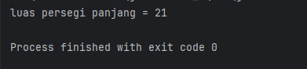  

---

## 4. Percabangan (If-Else dan Switch-Case)
Percabangan digunakan untuk mengambil keputusan berdasarkan kondisi.
if-else:
```declarative
if (kondisi) {
    // Blok kode jika kondisi true
} else {
    // Blok kode jika kondisi false
}
```
switch-case:
```declarative
switch (variabel) {
    case nilai1:
        // Blok kode jika variabel == nilai1
        break;
    case nilai2:
        // Blok kode jika variabel == nilai2
        break;
    default:
        // Blok kode jika tidak ada case yang sesuai
}
```
## langkah pratikum:
1. Buat sebuah class baru di dalam package `modul_1` dan beri nama `Percabangan`
2. Tuliskan kode berikut:
```declarative
package pratikum_1;

public class Percabangan {
    public static void main(String[] args){
        int nilai = 85;

        if(nilai >=75){
            System.out.println("Anda Lulus");
        }else{
            System.out.println("Anda tidak lulus");
        }
    }
}
```
3. Jalankan program nya untuk melihat hasil.  
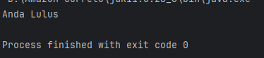  

## latihan:
Buat program untuk menentukan apakah suatu bilangan genap atau ganjil.
```declarative
package pratikum_1.latihan;

public class LatihanPercabangan {
    public static void main(String[] args){
        int n=8;

        if(n%2 == 0){
            System.out.println(n + " adalah genap");
        }else{
            System.out.println(n + " adalah ganjil");
        }
    }
}
```

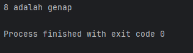  
---

## 5. Perulangan (For, While, Do-While)
Perulangan digunakan untuk mengulang blok kode.
for:
```declarative
for (inisialisasi; kondisi; update) {
    // Blok kode yang diulang
}
```
while:
```declarative
while (kondisi) {
    // Blok kode yang diulang
}
```
do-while:
```declarative
while (kondisi) {
    // Blok kode yang diulang
}
```

## langkah pratikum:
1. Buat sebuah class baru di dalam package `modul_1` dan beri nama `Perulangan`
2. Tuliskan kode berikut:
```declarative
package pratikum_1;

public class Perulangan {
    public static void main(String[] args){
        for(int i = 1; i<= 5; i++){
            System.out.println("Iterasi ke-" +i );
        }
    }
}
```
3. jalankan program  
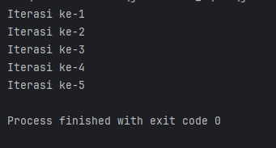  

## latihan:
Buat program untuk mencetak bilangan ganjil dari 1 hingga 20. Buat 3 program dengan menggunakan for, while, do-while.
```declarative
package pratikum_1.latihan;

public class LatihanPerulangan {
    public static void main(String[] args){
        for(int i = 1; i <= 20; i+=2){
            System.out.println(i);
        }
    }
}
```
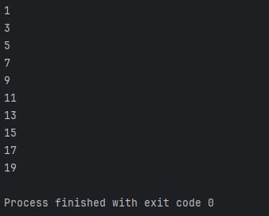  

---

## 6. Practice Problem dan Solusinya
Practice Problem:

1. Buat program untuk menghitung faktorial dari suatu bilangan.
2. Buat program untuk mengecek apakah suatu bilangan adalah bilangan prima.
3. Buat program untuk mencetak pola segitiga menggunakan *.

**solusi**
1. Buat sebuah class baru di dalam package `modul_1` dan beri nama `Factorial` dan isikan kode berikut. Kemudian jalankan untuk melihat hasilnya.
```declarative
package pratikum_1;

public class Faktorial {
    public static void main(String[] args){
        int n = 5;
        int hasil = 1;
        for(int i = 1; i <= n; i++){
            hasil *= i;
        }
        System.out.println("Faktorial dari " + n + " adalah " + hasil);
    }
}
```
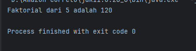  
2. Buat sebuah class baru di dalam package `modul_1` dan beri nama `Prima` dan isikan kode berikut. Kemudian jalankan untuk melihat hasilnya.
```declarative
package pratikum_1;

public class Prima {
    public static void main(String[] args){
        int n = 7;
        boolean isPrima = true;
        for(int i = 2; i<= n/2 ; i++){
            if(n % i == 0){
                isPrima = false;
                break;
            }
        }
        System.out.println(n + (isPrima ? " adalah bilangan prima." : "bukan bilangan prima."));
    }
}
```
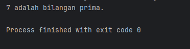  
3. Buat sebuah class baru di dalam package `modul_1` dan beri nama `Segitiga` dan isikan kode berikut. Kemudian jalankan untuk melihat hasilnya.
```declarative
package pratikum_1;

public class Segitiga {
    public static void main(String[] args){
        int tinggi = 5;
        for(int i =1; i <= tinggi; i++){
            for(int j =1; j <= i; j++){
                System.out.print("*");
            }
            System.out.println();
        }
    }
}
```
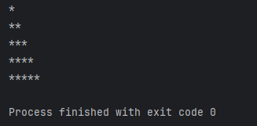  