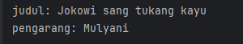
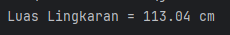
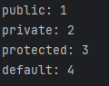
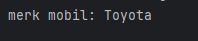
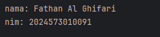
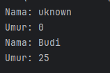
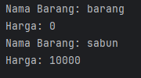
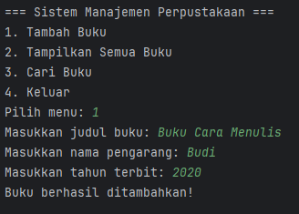
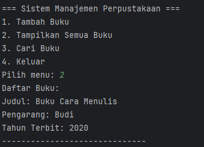
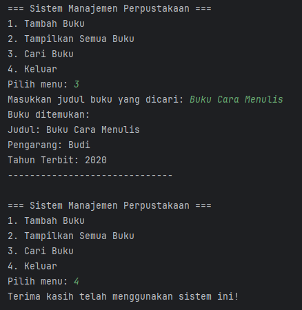

# Laporan Modul 2: Review Konsep Dasar OOP Menggunakan Java
**Mata Kuliah:** Praktikum DESIGN PATTERN   
**Nama:** Fathan Al Ghifari  
**NIM:** 2024573010091  
**Kelas:** TI 2A

---
## 1. Class dan Object
1. Class adalah blueprint atau cetakan untuk membuat objek. Class mendefinisikan atribut (variabel) dan method (fungsi) yang dimiliki oleh objek.
2. Object adalah instance dari class. Object memiliki state (nilai dari atribut) dan behavior (method).


### Langkah Praktikum
1. Buka project pada praktikum sebelumnya menggunakan intellij IDEA
2. Buat sebuah package baru di dalam folder `src` dengan cara klik kanan pada folder `src` kemudian pilih `New -> Package`. Beri nama `modul_2`.
3. Buat Sebuah package baru lagi didalam package `modul_2` dengan cara klik kanan dan pilih `New -> Package`. Beri nama `bagian_1`
4. Kemudian buat sebuah class baru dengan nama `Mahasiswa` dan isikan kode berikut:
```declarative
package pratikum_2.bagian_1;

public class Mahasiswa {
    String nama;
    int umur;
}
```


5. Selanjutnya, buat sebuah class baru dengan nama `Main` dan isikan kode berikut:
```declarative
package pratikum_2.bagian_1;

public class Main {
    public static void main(String[] args){
        Mahasiswa mhs1 = new Mahasiswa();
        mhs1.nama = "Budi";
        mhs1.umur = 20;

        System.out.println("Nama: " + mhs1.nama);
        System.out.println("Umur: " + mhs1.umur);
    }
}
```


hasilnya:  


### Latihan
1. Buatlah class Buku dengan atribut judul dan pengarang.
2. Buat object dari class Buku dan isi nilai atributnya.
3. Tampilkan nilai atribut tersebut.
```declarative
package pratikum_2.latihan.latihan_1;

public class Buku {
    String judul;
    String pengarang;
}

class main1{
    public static void main(String[] args){
        Buku buku1 = new Buku();
        buku1.judul = "Jokowi sang tukang kayu";
        buku1.pengarang = "Mulyani";
    }
}
```
hasilnya:  


---
## 2. Attribute dan Method
1. Attribute adalah variabel yang dimiliki oleh class atau object.
2. Method adalah fungsi atau perilaku yang dimiliki oleh class atau object.

### Langkah Praktikum
1. Buat Sebuah package baru lagi didalam package `modul_2` dengan cara klik kanan dan pilih `New -> Package`. Beri nama `bagian_2`
2. Kemudian buat sebuah class baru dengan nama `Kalkulator` dan isikan kode berikut:
```declarative
package pratikum_2.bagian_2;

public class Kalkulator {
    int angka1;
    int angka2;

    int tambah(){
        return angka1 + angka2;
    }
}
```

3. Kemudian buat sebuah class baru dengan nama `Main` dan isikan kode berikut:
```declarative
package pratikum_2.bagian_2;

public class Main {
    public static void main(String[] args){
        Kalkulator kalkulator = new Kalkulator();
        kalkulator.angka1 = 5;
        kalkulator.angka2 = 10;

        System.out.println("Hasil Penjumlahan = " + kalkulator.tambah());
    }
}
```

hasilnya:  


### Latihan
1. Buat class `Lingkaran` dengan atribut `jariJari`.
2. Tambahkan method `hitungLuas()` yang mengembalikan nilai luas lingkaran.
3. Buat object dari class Lingkaran dan panggil method `hitungLuas()`.
```declarative
package pratikum_2.latihan.latihan_2;

public class Lingkaran {
    double jariJari;

    double hitungLuas(){
        return 3.14 * (jariJari*jariJari);
    }
}
```
```declarative
package pratikum_2.latihan.latihan_2;

public class Lingkaran {
    double jariJari;

    double hitungLuas(){
        return 3.14 * (jariJari*jariJari);
    }
}
```

hasilnya:  

---

## 3. Akses Modifier
1. Akses Modifier menentukan tingkat akses dari class, atribut, atau method.
2. Jenis akses modifier:
   `public` : Dapat diakses dari mana saja.
   `private` : Hanya dapat diakses dalam class yang sama.
   `protected` : Dapat diakses dalam package yang sama dan subclass.
   `default` : Hanya dapat diakses dalam package yang sama.

### Langkah Praktikum
1. Buat Sebuah package baru lagi didalam package `modul_2` dengan cara klik kanan dan pilih `New -> Package`. Beri nama `bagian_3`
2. Kemudian buat sebuah class baru dengan nama `AksesModifier` dan isikan kode berikut:
```declarative
package pratikum_2.bagian_3;

public class AkeskModifier {
    public int publicVar = 1;
    private int privateVar = 2;
    protected int protectedVar = 3;
    int defaultVar = 4;

    public void tampilkan(){
        System.out.println("public: " + publicVar);
        System.out.println("private: " + privateVar);
        System.out.println("protected: " + protectedVar);
        System.out.println("default: " + defaultVar);
    }
}
```

3. Kemudian buat sebuah class baru dengan nama `Main` dan isikan kode berikut:
```declarative
package pratikum_2.bagian_3;

public class Main {
    public static void main(String[] args){
        AkeskModifier contoh = new AkeskModifier();
        contoh.tampilkan();
    }
}
```

hasilnya:  


### Latihan
1. Buat class AkunBank dengan atribut `saldo (private)` dan method `tampilkanSaldo() (public)`.
2. Coba akses atribut saldo langsung dari luar class. Apa yang terjadi?
```declarative
package pratikum_2.latihan.latihan_3;

public class AkunBank {
    private int saldo = 100;

    public void tampilkanSaldo(){
        System.out.println("Saldo: " + saldo);
    }
}
```
```declarative
package pratikum_2.latihan.latihan_3;

public class Main {
    public static void main(String[] args){
       AkunBank contoh = new AkunBank();
       contoh.tampilkanSaldo();
    }
}
```

hasilnya:  

---
## 4. Setter dan Getter
1. Setter adalah method untuk mengubah nilai atribut.
2. Getter adalah method untuk mengambil nilai atribut.
3. Setter dan Getter digunakan untuk mengakses atribut yang memiliki akses modifier private.

### Langkah Praktikum
1. Buat Sebuah package baru lagi didalam package `modul_2` dengan cara klik kanan dan pilih `New -> Package`. Beri nama `bagian_4`
2. Kemudian buat sebuah class baru dengan nama `Mobil` dan isikan kode berikut:
```declarative
package pratikum_2.bagian_4;

public class Mobil {
    private String merk;

    public void setMerk(String merk){
        this.merk = merk;
    }

    public String getMerk(){
        return merk;
    }
}
```

3. Kemudian buat sebuah class baru dengan nama `Main` dan isikan kode berikut:
```declarative
package pratikum_2.bagian_4;

public class Main {
    public static void main(String[] args){
        Mobil mobil = new Mobil();
        mobil.setMerk("Toyota");

        System.out.println("merk mobil: " + mobil.getMerk());
    }
}
```

hasilnya:  



### Latihan
1. Buat class Mahasiswa dengan atribut nama (private) dan nim (private).
2. Buat setter dan getter untuk kedua atribut tersebut.
3. Buat object dari class Mahasiswa dan gunakan setter untuk mengisi nilai atribut.
```declarative
package pratikum_2.latihan.latihan_4;

public class Mahasiswa {
    private String nama;
    private String nim;

    public void setNama(String nama){
        this.nama = nama;
    }

    public void setNim(String nim){
        this.nim = nim;
    }

    public String getNama(){
        return nama;
    }

    public String getNim(){
        return nim;
    }
}
```
```declarative
package pratikum_2.latihan.latihan_4;

public class Main {
    public static void main(String[] args){
        Mahasiswa mhs1 = new Mahasiswa();
        mhs1.setNama("Fathan Al Ghifari");
        mhs1.setNim("2024573010091");

        System.out.println("nama: " + mhs1.getNama());
        System.out.println("nim: " + mhs1.getNim());
    }
}
```
hasilnya:  


---

## 5. Constructor
1. Constructor adalah method khusus yang dipanggil saat object dibuat.
2. Jenis constructor:
   `Default Constructor` : Tanpa parameter.
   `Parameterized Constructor` : Dengan parameter.
   `Constructor Overloading` : Beberapa constructor dengan parameter berbeda.

### Langkah Praktikum
1. Buat Sebuah package baru lagi didalam package `modul_2` dengan cara klik kanan dan pilih `New -> Package`. Beri nama `bagian_5`
2. Kemudian buat sebuah class baru dengan nama `Person` dan isikan kode berikut:
```declarative
package pratikum_2.bagian_5;

public class Person {
    private String nama;
    private int umur;

    public Person(){
        nama = "uknown";
        umur = 0;
    }

    public Person(String nama, int umur){
        this.nama = nama;
        this.umur = umur;
    }

    public void tampilkanInfo(){
        System.out.println("Nama: " + nama);
        System.out.println("Umur: " + umur);
    }
}
```


3. Kemudian buat sebuah class baru dengan nama `Main` dan isikan kode berikut:
```declarative
package pratikum_2.bagian_5;

public class Main {
    public static void main(String[] args){
        Person person1 = new Person();
        Person person2 = new Person("Budi",25);

        person1.tampilkanInfo();
        person2.tampilkanInfo();
    }
}
```


hasilnya:  


### Latihan
1. Buat class `Barang` dengan atribut `namaBarang` dan `harga`.
2. Buat `default constructor` dan `parameterized constructor`.
3. Buat object dari class `Barang` menggunakan kedua constructor tersebut.
```declarative
package pratikum_2.latihan.latihan_5;

public class Barang {
    String namaBarang;
    int harga;

    public Barang(){
        namaBarang = "barang";
        harga = 0;
    }

    public Barang(String namaBarang, int harga){
        this.namaBarang = namaBarang;
        this.harga = harga;
    }

    public void tampilkanInfo(){
        System.out.println("Nama Barang: " + namaBarang);
        System.out.println("Harga: " + harga);
    }
}
```
```declarative
package pratikum_2.latihan.latihan_5;

public class Main {
    public static void main(String[] args){
        Barang barang1 = new Barang();
        Barang barang2 = new Barang("sabun",10000);

        barang1.tampilkanInfo();
        barang2.tampilkanInfo();
    }
}
```
hasilnya:  

---

## 6. Sistem Manajemen Perpustakaan Sederhana
Berikut adalah contoh program konsol sederhana yang mengimplementasikan seluruh konsep yang telah dibahas sebelumnya, yaitu class, object, attribute, method, akses modifier, setter-getter, dan constructor. Program ini adalah sistem manajemen perpustakaan sederhana yang memungkinkan pengguna untuk menambahkan buku, menampilkan daftar buku, dan mencari buku berdasarkan judul.

### Langkah Praktikum
1. Buat Sebuah package baru lagi didalam package `modul_2` dengan cara klik kanan dan pilih `New -> Package`. Beri nama `bagian_6`
2. Kemudian buat sebuah class baru dengan nama `Buku` dan isikan kode berikut:
```declarative
package pratikum_2.bagian_6;

public class Buku {
    private String judul;
    private String pengarang;
    private int tahunTerbit;

    public Buku(){
        this.judul = "unknown";
        this.pengarang = "unknown";
        this.tahunTerbit = 0;
    }

    public Buku(String judul, String pengarang, int tahunTerbit){
        this.judul = judul;
        this.pengarang = pengarang;
        this.tahunTerbit = tahunTerbit;
    }

    public void setjudul(String judul) {
        this.judul = judul;
    }

    public String getjudul() {
        return judul;
    }

    public void setpengarang(String pengarang) {
        this.pengarang = pengarang;
    }

    public String getPengarang() {
        return pengarang;
    }

    public void settahunTerbit(int tahunTerbit) {
        this.tahunTerbit = tahunTerbit;
    }

    public int gettahunTerbit() {
        return tahunTerbit;
    }

    public void tampilkanInfo() {
        System.out.println("Judul: " + judul);
        System.out.println("Pengarang: " + pengarang);
        System.out.println("Tahun Terbit: " + tahunTerbit);
        System.out.println("------------------------------");
    }
}
```


3. Kemudian buat sebuah class baru dengan nama `Perpustakaan` dan isikan kode berikut:
```declarative
package pratikum_2.bagian_6;

import java.util.ArrayList;

public class Perpustakaan {
    // Atribut (private)
    private ArrayList<Buku> daftarBuku;

    // Constructor
    public Perpustakaan() {
        daftarBuku = new ArrayList<>();
    }

    // Method untuk menambahkan buku
    public void tambahBuku(Buku buku) {
        daftarBuku.add(buku);
        System.out.println("Buku berhasil ditambahkan!");
    }

    // Method untuk menampilkan semua buku
    public void tampilkanSemuaBuku() {
        if (daftarBuku.isEmpty()) {
            System.out.println("Tidak ada buku dalam perpustakaan.");
        } else {
            System.out.println("Daftar Buku:");
            for (Buku buku : daftarBuku) {
                buku.tampilkanInfo();
            }
        }
    }

    // Method untuk mencari buku berdasarkan judul
    public void cariBuku(String judul) {
        boolean ditemukan = false;
        for (Buku buku : daftarBuku) {
            if (buku.getjudul().equalsIgnoreCase(judul)) {
                System.out.println("Buku ditemukan:");
                buku.tampilkanInfo();
                ditemukan = true;
                break;
            }
        }
        if (!ditemukan) {
            System.out.println("Buku dengan judul \"" + judul + "\" tidak ditemukan.");
        }
    }
}
```


4. Kemudian buat sebuah class baru dengan nama `Main` dan isikan kode berikut:
```declarative
package pratikum_2.bagian_6;

import java.util.Scanner;

public class Main {
    public static void main(String[] args) {
        Scanner scanner = new Scanner(System.in);
        Perpustakaan perpustakaan = new Perpustakaan();
        int pilihan;

        do {
            // Menu
            System.out.println("\n=== Sistem Manajemen Perpustakaan ===");
            System.out.println("1. Tambah Buku");
            System.out.println("2. Tampilkan Semua Buku");
            System.out.println("3. Cari Buku");
            System.out.println("4. Keluar");
            System.out.print("Pilih menu: ");
            pilihan = scanner.nextInt();
            scanner.nextLine(); // Membersihkan newline

            switch (pilihan) {
                case 1:
                    // Tambah Buku
                    System.out.print("Masukkan judul buku: ");
                    String judul = scanner.nextLine();
                    System.out.print("Masukkan nama pengarang: ");
                    String pengarang = scanner.nextLine();
                    System.out.print("Masukkan tahun terbit: ");
                    int tahunTerbit = scanner.nextInt();
                    scanner.nextLine(); // Membersihkan newline

                    Buku bukuBaru = new Buku(judul, pengarang, tahunTerbit);
                    perpustakaan.tambahBuku(bukuBaru);
                    break;

                case 2:
                    // Tampilkan Semua Buku
                    perpustakaan.tampilkanSemuaBuku();
                    break;

                case 3:
                    // Cari Buku
                    System.out.print("Masukkan judul buku yang dicari: ");
                    String judulCari = scanner.nextLine();
                    perpustakaan.cariBuku(judulCari);
                    break;

                case 4:
                    // Keluar
                    System.out.println("Terima kasih telah menggunakan sistem ini!");
                    break;

                default:
                    System.out.println("Pilihan tidak valid. Silakan coba lagi.");
            }
        } while (pilihan != 4);

        scanner.close();
    }
}
```

### Penjelasan Program:
1. Class Buku:
    - Memiliki atribut judul, pengarang, dan tahunTerbit (semua private).
    - Menggunakan constructor (default dan parameterized) untuk inisialisasi objek.
    - Menggunakan setter dan getter untuk mengakses dan memodifikasi atribut.
    - Memiliki method tampilkanInfo() untuk menampilkan informasi buku.

2. Class Perpustakaan:
    - Menggunakan ArrayList untuk menyimpan daftar buku.
    - Memiliki method tambahBuku(), tampilkanSemuaBuku(), dan cariBuku() untuk mengelola buku.

3. Class Main:
    - Menyediakan menu interaktif untuk pengguna.
    - Menggunakan Scanner untuk menerima input dari pengguna.
    - Mengimplementasikan semua fitur yang telah dibuat di class Buku dan Perpustakaan.

### Output Program:
Ikuti instruksi di menu untuk menambahkan buku, menampilkan buku, atau mencari buku.


hasilnya:  
  
  



---

## Penutup
Modul ini telah membahas konsep dasar OOP dalam Java, termasuk class, object, attribute, method, akses modifier, setter-getter, dan constructor. Dengan memahami materi ini, Anda dapat mulai membangun aplikasi Java yang lebih kompleks menggunakan prinsip-prinsip OOP.