# Laporan Modul LSP & Strategy Pattern
**Mata Kuliah:** Praktikum DESIGN PATTERN   
**Nama:** Fathan Al Ghifari  
**NIM:** 2024573010091  
**Kelas:** TI 2A
---
# SOLID Principle : Liskov Subtitution Principle (LSP)

## Tujuan
Setelah mengikuti praktikum ini, mahasiswa diharapkan mampu:
1. Memahami konsep Liskov Substitution Principle (LSP) sebagai bagian dari SOLID principles.
2. Menjelaskan manfaat dan tantangan penerapan LSP dalam desain perangkat lunak.
3. Mampu mengidentifikasi pelanggaran prinsip LSP dalam kode.
4. Menerapkan prinsip LSP dalam praktik melalui refactoring kode yang melanggar prinsip ini.
---

SOLID adalah lima prinsip desain dalam pemrograman berorientasi objek (OOP) yang membantu dalam menciptakan perangkat lunak yang mudah dipelihara dan dikembangkan. SOLID terdiri dari:
1. Single Responsibility Principle (SRP)
2. Open-Closed Principle (OCP)
3. Liskov Substitution Principle (LSP)
4. Interface Segregation Principle (ISP)
5. Dependency Inversion Principle (DIP)

### Manfaat penerapan SOLID:
- Meningkatkan keterbacaan dan pemeliharaan kode.
- Mengurangi ketergantungan antar komponen.
- Mempermudah pengujian unit dan integrasi.
- Memudahkan pengembangan fitur baru.

Software Design Principle adalah panduan atau aturan yang membantu pengembang dalam menulis kode yang clean, maintainable, dan scalable. Dengan mengikuti prinsip-prinsip ini, kode menjadi lebih mudah dipahami, diuji, diubah, dan dikembangkan lebih lanjut.

## Liskov Subtitution Principle (LSP)
Liskov Substitution Principle adalah salah satu prinsip dalam SOLID principles yang pertama kali diperkenalkan oleh Barbara Liskov pada tahun 1987. Prinsip ini menyatakan:

> "Jika `S` adalah subtype dari `T`, maka objek-objek dari tipe `T` dalam program harus dapat digantikan dengan objek-objek dari tipe `S` tanpa mengubah sifat-sifat dari program."

Dalam konteks pemrograman berorientasi objek, ini berarti kelas turunan (subclass) harus bisa digunakan sebagai pengganti kelas induknya (superclass) tanpa menyebabkan kesalahan atau perubahan perilaku yang tidak diinginkan. Objek dari kelas turunan bisa digunakan di mana pun objek dari kelas induknya digunakan tanpa merusak atau mengubah perilaku program yang sudah berjalan dengan benar.

Tujuan utama dari LSP adalah untuk menjaga keandalan dan kestabilan program saat melakukan substitusi objek. Artinya, ketika kita menggunakan objek dari kelas turunan, program tetap bekerja seperti ketika menggunakan objek dari kelas induknya.

### Penjelasan Prinsip LSP dengan Contoh
#### Contoh pelanggaran LSP
Misalnya, kita memiliki sebuah kelas induk `Kendaraan` dan sebuah method `bergerak()` seperti berikut:

```java
class Kendaraan {
    public void bergerak() {
        System.out.println("Kendaraan bergerak...");
    }
}

// Subclass Mobil
class Mobil extends Kendaraan {
    @Override
    public void bergerak() {
        System.out.println("Mobil melaju di jalan...");
    }
}

// Subclass KapalSelam - pelanggaran LSP
class KapalSelam extends Kendaraan {
    @Override
    public void bergerak() {
        throw new UnsupportedOperationException("Kapal selam tidak bisa bergerak di darat!");
    }
}

// Main program
public class Main {
    public static void jalankanKendaraan(Kendaraan k) {
        k.bergerak(); // Akan error jika objek KapalSelam digunakan
    }

    public static void main(String[] args) {
        Kendaraan mobil = new Mobil();
        Kendaraan kapalSelam = new KapalSelam();

        jalankanKendaraan(mobil);        // OK
        jalankanKendaraan(kapalSelam);   // Error: UnsupportedOperationException
    }
}
```
Contoh kode diatas melanggar aturan LSP karena:
* `Kendaraan` adalah superclass yang memiliki method `bergerak()`.
* `Mobil` dan `KapalSelam` adalah subclass yang mewarisi class `Kendaraan`.
* Namun, `KapalSelam` mengubah perilaku dari method `bergerak()` dengan cara memberikan output error jika digunakan sebagai object dari `Kendaraan`.


Berdasarkan pernyataan dari prinsip LSP, contoh kode diatas sudah melanggar karena, ketika kita menggunakan `KapalSelam` sebagai `Kendaraan`, program menjadi error karena `bergerak()` tidak bisa dijalankan.

```java
jalankanKendaraan(new KapalSelam()); // ERROR!
```
Ini menunjukkan bahwa `KapalSelam` tidak bisa menggantikan `Kendaraan` dengan aman.

Untuk memperbaiki kode diatas agar memenuhi aturan dari LSP, kita harus mengubah desain kelasnya agar tidak memaksa subclass untuk mengimplementasikan perilaku yang tidak cocok untuk mereka. kita bisa memisahkan tanggung jawab antar jenis kendaraan melalui interface, sehingga setiap objek hanya menerima perilaku yang benar-benar relevan dengannya. Tidak ada subclass yang melempar error atau mengubah kontrak perilaku superclass.

Gunakan Abstraksi yang Lebih Tepat. Masalah muncul karena kita membuat subclass `KapalSelam` mewarisi dari class `Kendaraan`, dan class `Kendaraan` punya method `bergerak()` yang tidak relevan atau tidak cocok untuk subclass `KapalSelam`.

#### Contoh kode yang memenuhi aturan LSP
Untuk memperbaikinya, kita bisa melakukan refactoring hierarki pewarisan menjadi lebih spesifik seperti berikut:

```java
// Interface umum untuk semua kendaraan
interface Kendaraan {}

// Interface khusus untuk kendaraan darat
interface KendaraanDaratan extends Kendaraan {
    void bergerak();
}

// Interface khusus untuk kendaraan laut
interface KendaraanLaut extends Kendaraan {
    void menyelam();
}

// Implementasi Mobil sebagai kendaraan darat
class Mobil implements KendaraanDaratan {
    public void bergerak() {
        System.out.println("Mobil melaju di jalan...");
    }
}

// Implementasi KapalSelam sebagai kendaraan laut
class KapalSelam implements KendaraanLaut {
    public void menyelam() {
        System.out.println("Kapal selam menyelam di laut...");
    }
}

// Main program
public class Main {
    public static void jalankanKendaraanDaratan(KendaraanDaratan k) {
        k.bergerak();
    }

    public static void jalankanKendaraanLaut(KendaraanLaut k) {
        k.menyelam();
    }

    public static void main(String[] args) {
        Mobil mobil = new Mobil();
        KapalSelam kapalSelam = new KapalSelam();

        jalankanKendaraanDaratan(mobil);     // OK
        jalankanKendaraanLaut(kapalSelam);   // OK
    }
}
```
Dari contoh kode yang sudah di refactor diatas, kita bisa lihat bahwa:
* Class `Kendaraan` dipecah menjadi dua jenis yang lebih spesifik dan relevan, yaitu `KendaraanDaratan` yang memiliki method `bergerak()` dan `KendaraanLaut` memiliki method `menyelam()`
* Class Mobil mengimplementasikan `KendaraanDaratan`, karena memang bergerak di darat.
* Class `KapalSelam` mengimplementasikan `KendaraanLaut`, karena bergerak di laut.

Dengan demikian, kode diatas sudah memenuhi kesesuaian dengan LSP, yaitu, class `Mobil` bisa digunakan sebagai argumen dari method dengan tipe `KendaraanDaratan`, dan tidak menimbulkan error. Class `KapalSelam` bisa digunakan sebagai argumen dari method dengan tipe `KendaraanLaut`, dan berfungsi sebagaimana mestinya.

Tidak ada subclass yang mengabaikan kontrak dari interface-nya atau memberikan error karena fungsi yang tidak relevan.

### Mengapa LSP Penting?
1. Menjamin Keandalan dan Stabilitas Program
   LSP memastikan bahwa subclass dapat menggantikan superclass tanpa mengubah perilaku program. Ini berarti, kode yang kita buat lebih konsisten saat dijalankan. Tidak ada perilaku tak terduga saat subclass digunakan.
2. Mempermudah Perawatan dan Perluasan (Maintainability & Extensibility)
   Dengan mematuhi LSP, kita bisa menambahkan class baru (subclass) tanpa mengubah kode yang sudah ada. Kode menjadi modular, sehingga lebih mudah diubah atau dikembangkan.
3. Meningkatkan Reusabilitas Kode
   Desain yang sesuai denga LSP menghasilkan class-class yang reusable. Artinya, Komponen bisa dipakai ulang di berbagai tempat tanpa perlu penyesuaian besar. Kita bisa menggunakan polymorphism dengan aman.
4. Membantu Menghindari Bug dan Error
   Pelanggaran LSP sering menyebabkan runtime errors (seperti UnsupportedOperationException), Perilaku program yang tidak sesuai harapan dan Sulitnya melakukan debugging. Dengan mematuhi LSP, kita bisa menjamin bahwa semua subclass berperilaku seperti superclass-nya. Menghindari error yang sulit dideteksi.

---

### Kapan penerapan LSP perlu dijaga?
* Pada saat kita membuat hierarki kelas (Inheritance) dimana subclass mewarisi dari suatu superclass, tanyakan: “Apakah subclass ini benar-benar bisa menggantikan superclass tanpa menimbulkan efek samping?”. Jika tidak yakin, pertimbangkan menggunakan interface atau komposisi (composition) daripada pewarisan.
* Jika kita akan menggunakan objek subclass ke fungsi yang menerima superclass, maka LSP harus dijaga. Pastikan bahwa semua subclass memiliki perilaku yang valid dan sesuai.

---
## Praktikum
1. Buat sebuah package baru di dalam `src` dan beri nama `pratikum_6`

### Praktikum 1 : Rectangle-Square Problem
##### Kode yang melanggar aturan LSP
1. Buat sebuah package baru di dalam `pratikum_6` dan beri nama `bagian_1`
2. Buat sebuah package baru di dalam `bagian_1` dan beri nama `tanpa_lsp`
3. Buat class baru di dalam `tanpa_lsp` dengan nama `Rectangle` dan isikan kode seperti berikut:
```declarative
package pratikum_6.bagian_1.tanpa_LSP;

public class Rectangle {
    protected int width;
    protected int height;

    public void setWidth(int width){
        this.width = width;
    }

    public void setHeight(int height){
        this.height = height;
    }

    public int calculatedArea(){
        return width * height;
    }
}
```

4. Buat class `Square` dan isikan kode berikut:

```declarative
package pratikum_6.bagian_1.tanpa_LSP;

public class Square extends Rectangle{
    @Override
    public void setWidth(int width){
        super.setWidth(width);
        super.setHeight(width);
    }

    public void setHeight(int height){
        super.setHeight(height);
        super.setWidth(height);
    }
}

```

5. Buat class `Main` dan isikan kode berikut:

```declarative
package pratikum_6.bagian_1.tanpa_LSP;

public class Main {
    public static void testRectangle(Rectangle r) {
        r.setWidth(5);
        r.setHeight(4);
        System.out.println("hasil yang diharapkan: 20, hasil output: " + r.calculatedArea());
    }
    public static void main(String[] args){
        Rectangle rect = new Rectangle();
        testRectangle(rect);

        Rectangle square = new Square();
        testRectangle(square);
    }
}

```

hasilnya:
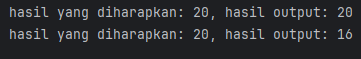

##### Permasalahan dari kode diatas:
- `Square` adalah subclass dari `Rectangle`.
- Namun, `Square` **mengubah perilaku** dari `setWidth()` dan `setHeight()`. Ketika kita mengubah lebar persegi (`width`), tingginya (`height`) juga otomatis berubah, dan sebaliknya.
- Ini **berbeda** dari ekspektasi pengguna `Rectangle`, yang berasumsi `setWidth()` hanya mengubah lebar, dan `setHeight()` hanya mengubah tinggi.

##### Dampak:
- Fungsi `testRectangle()` mengasumsikan bahwa dia bisa mengatur lebar dan tinggi secara independen.
- Saat dipanggil dengan objek `Square`, hasil `calculateArea()` tidak sesuai ekspektasi:
    - `r.setWidth(5)` → `width = 5, height = 5`
    - `r.setHeight(4)` → `height = 4, width = 4`
    - Area dihitung `4 * 4 = 16`, **bukan 20 seperti yang diharapkan**.
- Program gagal karena kontrak dari superclass (`Rectangle`) telah dilanggar oleh subclass (`Square`).

##### Refactor kode di atas untuk mematuhi aturan LSP
1. Buat sebuah package baru di dalam `bagian_1` dan beri nama `dengan_lsp`
2. Buat sebuah interface dengan nama `Shape` dan isikan kode berikut:

```declarative
package pratikum_6.bagian_1.dengan_LSP;

public interface Shape {
    int calculatedArea();
}

```

3. Buat sebuah class dengan nama `Rectangle` dan isikan kode berikut:

```declarative
package pratikum_6.bagian_1.dengan_LSP;

public class Rectagle implements Shape{
    private int width;
    private int height;

    public Rectagle(int width,int height){
        this.width = width;
        this.height = height;
    }

    @Override
    public int calculatedArea() {
        return width * height;
    }
}

```

4. Buat sebuah class dengan nama `Square` dan isikan kode berikut:

```declarative
package pratikum_6.bagian_1.dengan_LSP;

public class Square implements Shape{
    private int side;

    public Square(int side){
        this.side = side;
    }

    @Override
    public int calculatedArea() {
        return side * side;
    }
}

```

5. Buat sebuah class `Main` dan isikan kode berikut:

```declarative
package pratikum_6.bagian_1.dengan_LSP;

public class Main {
    public static void printArea(Shape shape){
        System.out.println("Luas: " + shape.calculatedArea());
    }

    public static void main(String[] args){
        Shape rectangle = new Rectagle(5,4);
        Shape square = new Square(4);

        printArea(rectangle);
        printArea(square);
    }
}

```

hasilnya:  
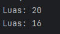

##### Analisa Solusi:
Pada versi yang benar:
- `Rectangle` dan `Square` tidak saling mewarisi.
- Keduanya mengimplementasikan interface `Shape` secara terpisah.
- Masing-masing bertanggung jawab penuh terhadap perilaku menghitung area (`calculateArea()`).

##### Dampak
- Prinsip LSP terpenuhi, karena`Rectangle` dan `Square` dapat diperlakukan sebagai `Shape` tanpa perubahan perilaku.
- Fungsi `printArea` cukup tahu bahwa objeknya adalah `Shape`, dan cukup memanggil `calculateArea()` tanpa khawatir bentuk spesifiknya.
- Area dihitung sesuai ekspektasi:
    - Rectangle (5x4) → Area: 20
    - Square (4x4) → Area: 16

---
#### Praktikum 2 : Sistem Posting Media Sosial
##### Kode yang melanggar aturan OCP
1. Buat sebuah package baru di dalam `modul_6` dan beri nama `bagian_2`
2. Buat sebuah package baru di dalam `bagian_2` dan beri nama `tanpa_lsp`
3. Buat class baru di dalam `tanpa_lsp` dengan nama `SocialMediaPost` dan isikan kode seperti berikut:

```declarative
package pratikum_6.bagian_2.tanpa_LSP;

public class SocialMediaPost {
    protected String content;

    public SocialMediaPost(String content){
        this.content = content;
    }

    public void publish(){
        System.out.println("Publishing post " + content);
    }

    public int calculatedMaxCharacter(){
        return 1000;
    }
}

```

4. Buat class `TwitterPost` dan isikan kode berikut:

```declarative
package pratikum_6.bagian_2.tanpa_LSP;

public class TwitterPost extends SocialMediaPost{
    public TwitterPost(String content){
        super(content);
    }

    @Override
    public int calculatedMaxCharacter() {
        return 280;
    }

    @Override
    public void publish() {
        if(content.length() > calculatedMaxCharacter()){
            throw new IllegalArgumentException("Tweer melebibi batas karakter!");
        }
        System.out.println("Posting Tweet: " + content);
    }
}

```

5. Buat class `BlogPost `dan isikan kode berikut:

```declarative
package pratikum_6.bagian_2.tanpa_LSP;

public class BlogSpot extends SocialMediaPost{
    private boolean isDraft;

    public BlogSpot(String content){
        super(content);
    }

    @Override
    public void publish(){
        if(!isDraft){
            throw new IllegalArgumentException("Blog ini sudah dipublish");
        }
        isDraft = false;
        super.publish();
    }

    public void editContent(String newContent){
        if(!isDraft){
            throw new IllegalArgumentException("Blog yang sudah dipublish tidak bisa diedit!");
        }
        this.content = newContent;
    }
}

```

6. Buat class `Main `dan isikan kode berikut:

```declarative
package pratikum_6.bagian_2.tanpa_LSP;

public class Main {
    public static void sharePost(SocialMediaPost post){
        try{
            post.publish();
            System.out.println("maksimum karakter: " + post.calculatedMaxCharacter());
        } catch (Exception e){
            System.out.println("Gagal membagi: " + e.getMessage());
        }
    }

    public static void main(String[] args){
        SocialMediaPost tweet = new TwitterPost("Hallo Twitter");
        SocialMediaPost longTweet = new TwitterPost("Tweet ini sangat panjang dan melebihi batas karakter....".repeat(10));
        SocialMediaPost blog = new BlogSpot("Modul 6 - Liskov Subtitution Principle");

        System.out.println("memposting tweet yang valid:");
        sharePost(tweet);

        System.out.println("memposting tweet yang tidak valid:");
        sharePost(longTweet);

        System.out.println("memposting blog:");
        sharePost(blog);

        System.out.println("memposting blog sekali lagi");
        sharePost(blog);
    }
}


```

hasilnya:  
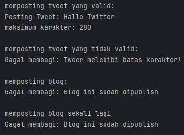

##### Permasalahan dari kode diatas
Pada kode diatas, kita memiliki:
`SocialMediaPost` sebagai superclass.`TwitterPost` dan `BlogPost` sebagai subclass. Namun, subclass mengubah perilaku `publish()` secara signifikan:
- `TwitterPost` melempar `IllegalArgumentException` jika melebihi batas karakter.
- `BlogPost` melempar `IllegalStateException` jika post sudah pernah dipublikasikan.

Sehingga, penggunaan `SocialMediaPost` di method `sharePost()` menjadi tidak aman dan harus menangani berbagai macam error yang tidak konsisten.

##### Pelanggaran terhadap LSP
- LSP dilanggar karena subclass (`TwitterPost`, `BlogPost`) tidak bisa digunakan secara aman sebagai pengganti superclass (`SocialMediaPost`).
- Method `sharePost()` harus aware terhadap kemungkinan kegagalan dan exception yang dilempar oleh subclass.
- Akibatnya, penggunaan polymorphism menjadi berisiko dan tidak transparan.

##### Dampak
- Kompleksitas bertambah di tempat yang menggunakan superclass (`sharePost`).
- Pola try-catch diperlukan untuk menangani perilaku tidak konsisten.
- Melemahkan prinsip substitusi karena kode harus mengetahui detail spesifik subclass.

---
##### Refactor kode di atas untuk mematuhi aturan OCP
1. Buat sebuah package baru di dalam `bagian_2` dan beri nama `dengan_lsp`
2. Buat sebuah interface dengan nama `Publishable` dan isikan kode berikut:

```declarative
package pratikum_6.bagian_2.dengan_LSP;

public interface Publishable {
    void publish();
    boolean canPublish();
    int getMaxContentLenght();
}

```

3. Buat sebuah class dengan nama `SocialPost` dan isikan kode berikut:

```declarative
package pratikum_6.bagian_2.dengan_LSP;

public class SocialPost implements Publishable{
    protected String content;

    public SocialPost(String content){
        this.content = content;
    }

    @Override
    public void publish(){
        System.out.println("publishing: " + content);
    }

    @Override
    public boolean canPublish(){
        return content.length() <= getMaxContentLenght();
    }

    @Override
    public int getMaxContentLenght(){
        return 1000;
    }
}

```

4. Buat sebuah class dengan nama `TwitterPost` dan isikan kode berikut:

```declarative
package pratikum_6.bagian_2.dengan_LSP;

public class TwitterPost implements Publishable{
    private static final int MAX_LENGHT = 200;
    private String content;

    public TwitterPost(String content){
        this.content = content;
    }

    @Override
    public void publish(){
        if(!canPublish()){
            throw new IllegalArgumentException("Tweet melebihi dari " + MAX_LENGHT + "karakter");
        }
        System.out.println("posting tweet: " + content);
    }

    @Override
    public boolean canPublish(){
        return content.length() <= MAX_LENGHT;
    }

    @Override
    public int getMaxContentLenght(){
        return MAX_LENGHT;
    }
}

```

5. Buat sebuah class dengan nama `BlogPost` dan isikan kode berikut:

```declarative
package pratikum_6.bagian_2.dengan_LSP;

public class BlogPost implements Publishable{
        private String content;
        private boolean isPublished;

        public BlogPost(String content){
            this.content = content;
        }

    @Override
    public void publish() {
        if(isPublished){
            return;
        }
        isPublished = true;
        System.out.println("publishing blog: " + content);
    }

    @Override
    public boolean canPublish() {
        return !isPublished;
    }

    @Override
    public int getMaxContentLenght(){
            return Integer.MAX_VALUE;
    }

    public void editContent(String newContent){
            if(isPublished){
                System.out.println("menambah update untuk blog yang sudah dipublish");
            }
            this.content = newContent;
    }
}

```

6. Buat sebuah class `Main` dan isikan kode berikut:

```declarative
package pratikum_6.bagian_2.dengan_LSP;

public class Main {
    public static void sharePost(Publishable post) {
        if (post.canPublish()) {
            post.publish();
            System.out.println("max lenght: " + post.getMaxContentLenght());
        } else {
            System.out.println("tidak bisa publish ini sekarang");
        }
    }

    public static void main(String[] args) {
        Publishable tweet = new TwitterPost("hello twitter");
        Publishable longTweet = new TwitterPost("ini kepanjangan...".repeat(20));
        Publishable blog = new BlogPost("saya rasa ini kode yang bersih");

        System.out.println("memposting tweet yang valid:");
        sharePost(tweet);

        System.out.println("\nmemposting tweet yang tidak valid:");
        sharePost(longTweet);

        System.out.println("\nmemposting blog:");
        sharePost(blog);

        System.out.println("\nmemposting blog sekali lagi");
        sharePost(blog);

        System.out.println("\nmengedit blog yang sudah di publish:");
        ((BlogPost) blog).editContent("Blog diupdate agar lebih rapi");
    }
}

```

hasilnya:  
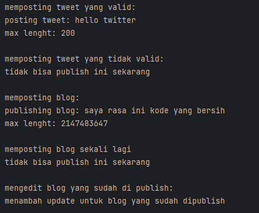

##### Analisa solusi
Kode ini mendemonstrasikan bagaimana memperbaiki pelanggaran Liskov Substitution Principle (LSP) pada aplikasi media sosial. Dengan menggunakan interface `Publishable`, semua jenis post (`SocialPost`, `TwitterPost`, `BlogPost`) memiliki kontrak perilaku yang konsisten.
- Semua class (`SocialPost`, `TwitterPost`, `BlogPost`) mengimplementasikan interface yang sama (`Publishable`).
- Tidak ada class yang mengubah perilaku fundamental saat digunakan melalui interface `Publishable`.
- Fungsi `sharePost(Publishable post)` bisa menerima objek apapun tanpa error atau perlakuan khusus.
- Semua subclass bisa menggantikan** superclass/interface tanpa menyebabkan perilaku yang tidak diharapkan.

##### Benefit dari Perbaikan Ini
- Polymorphism: `sharePost()` tidak perlu tahu jenis objek.
- Konsistensi Perilaku: Semua post memiliki jaminan method `publish()`, `canPublish()`, dan `getMaxContentLength()`.
- Lebih Mudah Diperluas: Menambahkan tipe post baru (misal `InstagramPost`) cukup dengan mengimplementasikan `Publishable`.

---
### Latihan : Aplikasi sistem navigasi kendaraan
Pada program ini, kita akan membuat sebuah sistem navigasi di mana beberapa kendaraan tidak dapat mengimplementasikan kontrak dari kelas dasar dengan benar. Kode program dibawah ini melanggar aturan lsp.

##### Masalah dari kode
- Sepeda dipaksa untuk mengimplementasikan perilaku yang berkaitan dengan mesin.
- Kontrak navigasi tidak jelas (apakah sepeda harus mengikuti logika rute yang sama?).
- Kelas dasar membuat asumsi yang tidak berlaku untuk semua jenis kendaraan.

1. buat interface `kendaraan` dan isi seperti kode ini:  
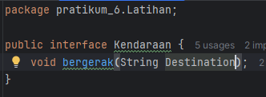
2. buat class `mobil`:  
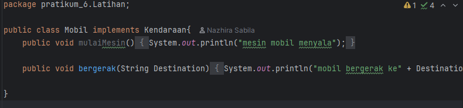
3. buat class `sepeda`:  
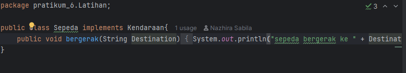
4. buat class `main`:  
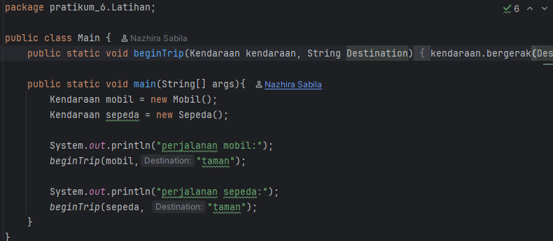

hasilnya:  
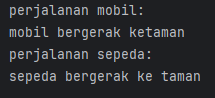

---
### Kesimpulan
Prinsip LSP menyatakan bahwa objek dari subclass harus bisa menggantikan objek dari superclass tanpa mengubah perilaku yang diinginkan dari program. Dengan kata lain, subclass harus menjaga kontrak yang ditetapkan oleh superclass, sehingga kode tetap berfungsi seperti yang diharapkan meskipun objek-objek tersebut digantikan. Ini mendorong desain yang lebih fleksibel dan mudah diperluas tanpa mempengaruhi kestabilan sistem yang ada.
Prinsip ini sangat penting dalam pengembangan perangkat lunak berorientasi objek, karena memastikan polimorfisme yang benar dan kode yang lebih mudah dipelihara serta diperluas di masa depan.

---
## Strategy Pattern

## Tujuan
Setelah mengikuti praktikum ini, mahasiswa diharapkan mampu:
1. Memahami konsep Strategy Pattern dan manfaatnya dalam desain perangkat lunak.
2. Mengimplementasikan Strategy Pattern dalam bahasa pemrograman Java.
3. Mampu mengidentifikasi situasi yang cocok untuk penggunaan Strategy Pattern
---

## Teori Singkat

Strategy Pattern adalah sebuah pola desain (design pattern) dalam pemrograman yang memungkinkan definisi serangkaian algoritma terpisah, mengenkapsulasi setiap algoritma, dan membuatnya dapat saling bertukar secara dinamis sesuai kebutuhan. Pola ini memisahkan algoritma dari kelas yang menggunakannya, sehingga memungkinkan perubahan algoritma tanpa mengubah kelas klien yang memanfaatkannya.

Dalam Strategy Pattern, algoritma diimplementasikan sebagai objek terpisah yang disebut strategi (strategy). Kelas klien yang menggunakan algoritma memiliki referensi ke salah satu objek strategi tersebut, dan menggunakan strategi tersebut untuk mengeksekusi algoritma tertentu.

Dengan menggunakan Strategy Pattern, kita dapat mencapai beberapa keuntungan, antara lain:

1. Fleksibilitas: Kita dapat dengan mudah mengganti algoritma yang digunakan oleh kelas klien tanpa mempengaruhi struktur kelas klien tersebut.
2. Pemisahan Kode: Algoritma-algoritma yang berbeda dienkapsulasi secara terpisah, sehingga memisahkan tanggung jawab dan mempermudah pemeliharaan serta pengembangan kode.
3. Mudah diuji: Memisahkan algoritma ke dalam objek terpisah memungkinkan pengujian yang lebih mudah, karena setiap algoritma dapat diuji secara terpisah.
4. Kode yang dapat digunakan kembali(reusable): Objek strategi dapat digunakan kembali dalam berbagai konteks yang berbeda, tanpa perlu mengubah kelas klien.

Dengan demikian, Strategy Pattern sangat berguna ketika kita memiliki serangkaian algoritma yang berbeda dan perlu memilih algoritma yang sesuai secara dinamis, atau ketika kita ingin meningkatkan fleksibilitas dan pemeliharaan kode dalam pengembangan perangkat lunak.

### Struktur Strategy Pattern
1. Strategy Interface → Mendefinisikan metode yang akan diimplementasikan oleh strategi-strategi konkret.
2. Concrete Strategy (Implementasi)→ Implementasi nyata dari interface strategy.
3. Context → Kelas yang menggunakan objek Strategy untuk menjalankan algoritma tertentu.

### Contoh Kasus
Misalnya kita ingin membuat program kalkulator diskon untuk toko online. Diskonnya bisa berbeda tergantung kondisi (misal: promo umum, diskon anggota, diskon musiman).

Implementasi strategy pattern dapat kita lakukan dengan cara berikut:
1. Strategy Interface
```java
public interface DiscountStrategy {
    double calculateDiscount(double price);
}
```
2. Concrete Strategies
```java
public class NoDiscount implements DiscountStrategy {
    public double calculateDiscount(double price) {
        return price;
    }
}

public class MemberDiscount implements DiscountStrategy {
    public double calculateDiscount(double price) {
        return price * 0.9; // 10% discount
    }
}

public class SeasonalDiscount implements DiscountStrategy {
    public double calculateDiscount(double price) {
        return price * 0.8; // 20% discount
    }
}

```
4. Context
```java
public class ShoppingCart {
    private DiscountStrategy discountStrategy;

    public ShoppingCart(DiscountStrategy discountStrategy) {
        this.discountStrategy = discountStrategy;
    }

    public double checkout(double price) {
        return discountStrategy.calculateDiscount(price);
    }

    public void setDiscountStrategy(DiscountStrategy discountStrategy) {
        this.discountStrategy = discountStrategy;
    }
}
```

Selanjutnya, untuk menggunakan kode diatas, kita bisa melakukannya seperti berikut:
```java
public class Main {
    public static void main(String[] args) {
        ShoppingCart cart = new ShoppingCart(new NoDiscount());
        System.out.println("Total: " + cart.checkout(100));

        cart.setDiscountStrategy(new MemberDiscount());
        System.out.println("Total (Member): " + cart.checkout(100));

        cart.setDiscountStrategy(new SeasonalDiscount());
        System.out.println("Total (Seasonal): " + cart.checkout(100));
    }
}
```

### Kapan Menggunakan Strategy Pattern?
1. Saat kamu memiliki banyak varian algoritma yang bisa digunakan secara bergantian.
2. Saat kamu ingin menghindari penggunaan banyak if-else atau switch di dalam kode.
3. Saat kamu ingin menambahkan algoritma baru tanpa memodifikasi kode yang sudah ada (Open/Closed Principle).

### Kelebihan:
1. Menerapkan prinsip Open/Closed dan Single Responsibility.
2. Memudahkan testing tiap strategi secara terpisah.
3. Membuat kode lebih modular dan fleksibel.

### Kekurangan:
1. Menambah jumlah kelas karena setiap strategi perlu dideklarasikan secara eksplisit.
2. Perlu pemahaman OOP yang baik untuk digunakan secara efektif.

---
## Praktikum
1. Buat sebuah package baru di dalam `src` dan beri nama `pratikum_7`

### Praktikum 1 : Program Navigasi Sederhana
##### Use Case
Aplikasi navigasi bisa menggunakan berbagai strategi rute: jalan kaki, berkendara, atau transportasi umum.

##### Langkah Praktikum
1. Buat sebuah package baru di dalam `pratikum_7` dan beri nama `bagian_1`
2. Kemudian buat sebuah interface `RouteStrategy` dan isikan kode berikut:

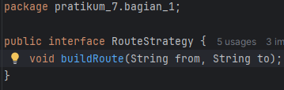

3. Buat class `WalkingRoute` dan isikan kode berikut:

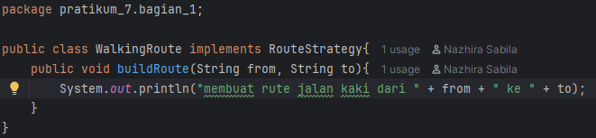

4. Buat class `DrivingRoute` dan isikan kode berikut:

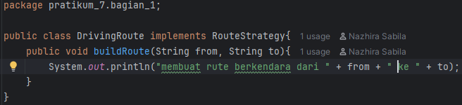

5. Buat class `PublicTransportRoute` dan isikan kode berikut:

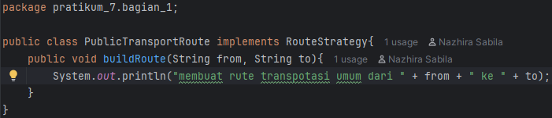

6. Buat class `Navigator` dan isikan kode berikut:

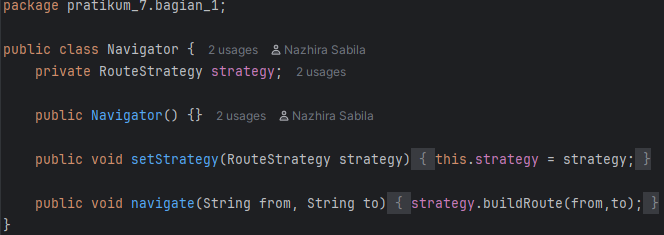

7. Buat class `Main` dan isikan kode berikut:

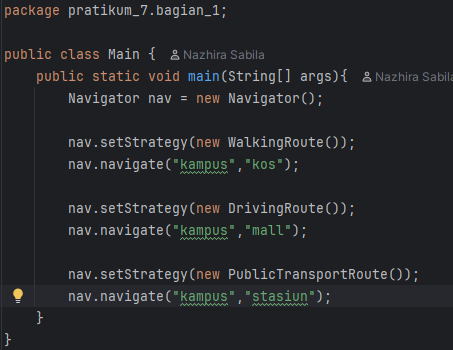

hasilnya:  
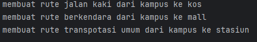

---
#### Praktikum 2 : Program Filter Foto Sederhana
##### Use Case
Aplikasi editing foto menyediakan berbagai filter: hitam-putih, sephia, dan cerah. Pengguna dapat memilih filter saat runtime.

##### Langkah Praktikum
1. Buat sebuah package baru di dalam `pratikum_7` dan beri nama `bagian_2`
2. Kemudian buat sebuah interface `FilterStrategy` dan isikan kode berikut:

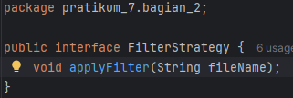

3. Buat class `BlackWhiteFilter` dan isikan kode berikut:

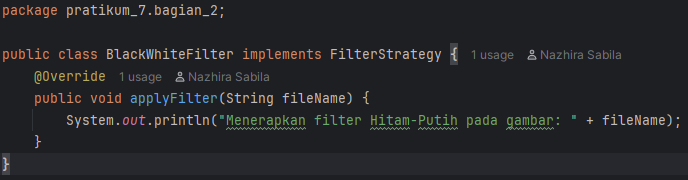

4. Buat class `SepiaFilter `dan isikan kode berikut:

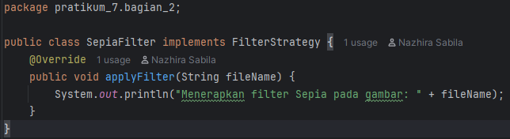

5. Buat class `BrightFilter `dan isikan kode berikut:

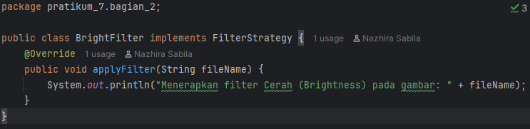

6. Buat class `PhotoEditor` dan isikan kode berikut:

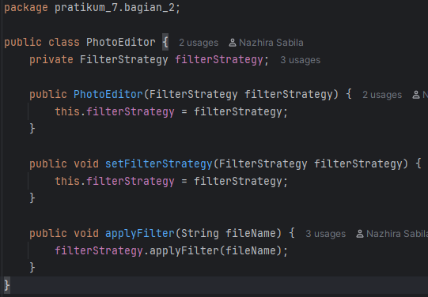

7. Buat class `Main` dan isikan kode berikut:

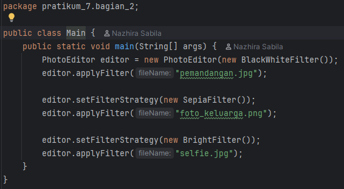

hasilnya:  
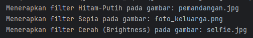

---
#### Praktikum 3 : Program Notifikasi
##### Use Case
Sistem dapat mengirim notifikasi dengan berbagai cara tergantung situasi pengguna: email, SMS, atau push.

##### Langkah Praktikum
1. Buat sebuah package baru di dalam `pratikum_7` dan beri nama `bagian_3`
2. Kemudian buat sebuah interface `NotificationStrategy` dan isikan kode berikut:

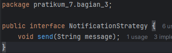

3. Buat class `EmailNotification` dan isikan kode berikut:

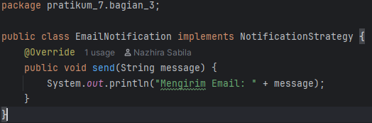

4. Buat class `SMSNotification` dan isikan kode berikut:

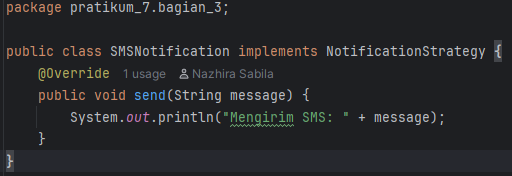

5. Buat class `PushNotification`dan isikan kode berikut:

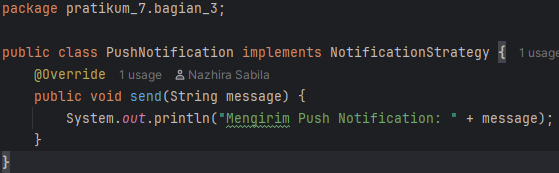

6. Buat class `NotificationService` dan isikan kode berikut:

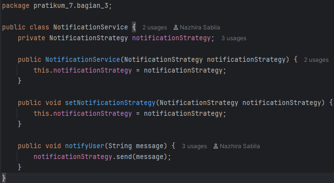

7. Buat class `Main` dan isikan kode berikut:

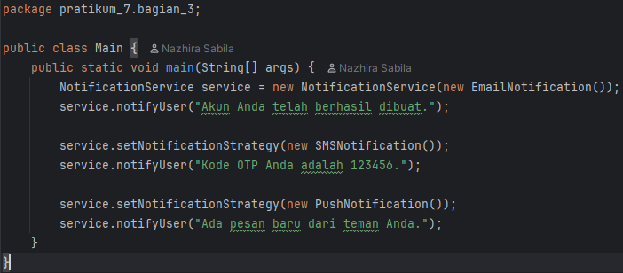

hasilnya:  
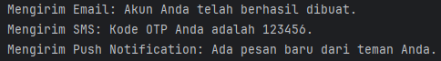

---

### Soal Latihan : Program Pembayaran E-Commerce (Strategy Pattern)
Deskripsi:
Anda diminta untuk mengembangkan sistem checkout sederhana yang mendukung tiga jenis metode pembayaran:
- Kartu Kredit
- E-Wallet
- Transfer Bank

#### Tugas Praktikum:
1. Buat interface `PaymentStrategy` dengan method `pay(double amount)`.
2. Buat tiga class yang mengimplementasikan `PaymentStrategy` yaitu: `CreditCardPayment`, `EWalletPayment`, dan `BankTransferPayment`.
3. Buat class `Checkout`(Contex Class) yang menggunakan `PaymentStrategy`.
4. Di dalam main, tunjukkan contoh penggunaan masing-masing metode pembayaran.

#### Tugas Analisis:
1. Jelaskan mengapa Strategy Pattern cocok digunakan dalam kasus pembayaran e-commerce.
2. Bagaimana jika suatu hari ingin menambahkan metode pembayaran baru seperti QRIS? Apakah Anda perlu mengubah class `Checkout`?

Catatan cara mengerjakan tugas praktikum
- Buatlah sebuah package baru di dalam `modul_9` dan beri nama `latihan`
- Di dalam `latihan`, buat sebuah package baru dan beri nama `praktikum` dan kerjakan tugas praktikum diatas di dalam package ini.
- Di dalam `latihan`, buatlah sebuah package baru dan beri nama `analisis`, kemudian jawab soal dari tugas analisis diatas di dalam package ini dengan cara, buat sebuah file baru dengan nama `jawabab.md` dan isikan jawaban anda di dalam file tersebut. Note: Tuliskan soal kembali di dalam file jawaban anda.

### Kesimpulan
Strategy Pattern adalah salah satu pola desain perilaku (behavioral design pattern) yang memungkinkan kita memilih algoritma (atau strategi) pada saat program berjalan (runtime) tanpa mengubah kode utama. Dengan kata lain, Strategy Pattern memisahkan logika "apa yang dilakukan" dari "bagaimana itu dilakukan".

#### Struktur Umum:
- Strategy (Interface/Abstract Class): Mendefinisikan kontrak untuk semua strategi.
- ConcreteStrategy: Implementasi spesifik dari strategi.
- Context: Kelas yang menggunakan Strategy dan dapat mengubahnya secara dinamis.