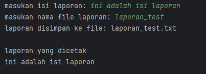
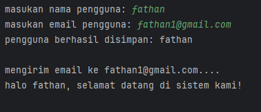

# Laporan Modul 4: SOLID Principle
**Mata Kuliah:** Praktikum DESIGN PATTERN   
**Nama:** Fathan Al Ghifari  
**NIM:** 2024573010091  
**Kelas:** TI 2A
---
## Bagian 1: Single Responsibility Principle (SRP)
### Tujuan

---

SOLID adalah lima prinsip desain dalam pemrograman berorientasi objek (OOP) yang membantu dalam menciptakan perangkat lunak yang mudah dipelihara dan dikembangkan. SOLID terdiri dari:
1. Single Responsibility Principle (SRP)
2. Open-Closed Principle (OCP)
3. Liskov Substitution Principle (LSP)
4. Interface Segregation Principle (ISP)
5. Dependency Inversion Principle (DIP)

#### Manfaat penerapan SOLID:
- Meningkatkan keterbacaan dan pemeliharaan kode.
- Mengurangi ketergantungan antar komponen.
- Mempermudah pengujian unit dan integrasi.
- Memudahkan pengembangan fitur baru.

## Single Responsibility Principle (SRP)

Single Responsibility Principle (SRP) atau prinsip tanggung jawab tunggal adalah salah satu dari lima prinsip SOLID dalam desain perangkat lunak yang menyatakan bahwa setiap kelas atau modul dalam sebuah sistem hanya boleh memiliki satu alasan untuk berubah. Artinya, setiap kelas harus memiliki satu tanggung jawab utama atau satu tujuan spesifik.

Prinsip ini pertama kali diperkenalkan oleh Robert C. Martin (Uncle Bob) dalam bukunya "Agile Software Development: Principles, Patterns, and Practices." Tujuan utama SRP adalah untuk meningkatkan modularitas, kemudahan pemeliharaan (maintainability), dan fleksibilitas (extensibility) dalam pengembangan perangkat lunak.

### Mengapa SRP Penting?
- Mengurangi Kompleksitas: Kelas yang memiliki banyak tanggung jawab akan menjadi kompleks dan sulit untuk dipahami atau diubah.
- Meningkatkan Kemudahan Pemeliharaan: Jika suatu kelas memiliki satu tanggung jawab, perubahan pada kode hanya akan berdampak pada satu aspek sistem.
- Memudahkan Pengujian (Testing): Kelas yang hanya memiliki satu tugas akan lebih mudah diuji secara unit testing karena dependensinya lebih sedikit.
- Mencegah Efek Samping yang Tidak Diinginkan: Jika satu kelas menangani banyak hal, perubahan kecil dapat menyebabkan bug di bagian lain yang tidak berhubungan.

---
### Contoh pelanggaran SRP
Misalkan kita memiliki sebuah kelas ReportManager yang menangani berbagai tugas terkait laporan seperti berikut:
```java
public class ReportManager {
    public void generateReport() {
        // Kode untuk membuat laporan
    }

    public void saveReportToFile(String filename) {
        // Kode untuk menyimpan laporan ke file
    }

    public void printReport() {
        // Kode untuk mencetak laporan
    }
}
```
Masalah pada kode di atas adalah, kelas ini menangani lebih dari satu tanggung jawab:
- Pembuatan laporan `generateReport()`
- Penyimpanan laporan ke file `saveReportToFile()`
- Pencetakan laporan `printReport()`

Jika terjadi perubahan dalam cara penyimpanan atau pencetakan laporan, kita harus mengubah `ReportManager`, yang bisa berdampak pada fungsi lain.

Agar kode bisa memenuhi prinsip SRP, Solusinya adalah memisahkan tanggung jawab ke dalam beberapa kelas yang lebih spesifik:

```java
// Bertanggung jawab hanya untuk pembuatan laporan
public class ReportGenerator {
    public String generateReport() {
        return "Laporan telah dibuat";
    }
}

// Bertanggung jawab hanya untuk menyimpan laporan ke file
public class ReportSaver {
    public void saveToFile(String report, String filename) {
        // Kode untuk menyimpan laporan ke file
    }
}

// Bertanggung jawab hanya untuk mencetak laporan
public class ReportPrinter {
    public void print(String report) {
        // Kode untuk mencetak laporan
    }
}
```
Dengan pemisahan ini:
`ReportGenerator` hanya menangani pembuatan laporan.
`ReportSaver` hanya menangani penyimpanan laporan.
`ReportPrinter` hanya menangani pencetakan laporan.

Hasilnya, setiap kelas memiliki satu tanggung jawab, yang membuat kode lebih mudah dikelola dan diuji.

Berikut adalah tabel yang merangkum **kelebihan dan kekurangan** dari **Single Responsibility Principle (SRP):**

| **Aspek**               | **Kelebihan**  | **Kekurangan**  |
|-------------------------|-----------------|-----------------|
| **Keterbacaan Kode**  | Kode lebih mudah dibaca dan dipahami karena setiap kelas hanya memiliki satu tanggung jawab. | Terlalu banyak kelas bisa membuat proyek terlihat lebih kompleks dan sulit dinavigasi. |
| **Pemeliharaan Kode**  | Perubahan hanya perlu dilakukan di satu tempat tanpa memengaruhi bagian lain. | Memerlukan lebih banyak waktu dalam perancangan untuk memisahkan tanggung jawab dengan baik. |
| **Reusability (Penggunaan Ulang Kode)**  | Kelas yang hanya menangani satu tugas lebih mudah digunakan kembali dalam proyek lain. | Pemisahan tanggung jawab yang terlalu ekstrim bisa menyebabkan banyak kelas dengan fungsi kecil yang sulit dikelola. |
| **Pengujian (Testing)** | Unit testing menjadi lebih mudah karena setiap kelas berdiri sendiri tanpa banyak dependensi. | Jika ada terlalu banyak kelas, kita harus mengatur dependensi antar kelas dengan baik agar pengujian tetap efisien. |
| **Efek Samping (Side Effects)**  | Mengurangi risiko bug karena perubahan pada satu bagian kode tidak memengaruhi bagian lain. | Bisa menyebabkan peningkatan kompleksitas dalam manajemen dependensi antara kelas yang saling berinteraksi. |
| **Kecepatan Pengembangan**  | Memudahkan tim dalam memahami dan mengembangkan fitur tanpa menyebabkan konflik antar modul. | Untuk proyek kecil atau prototipe cepat, memecah tanggung jawab bisa terasa seperti over-engineering. |

---
### Praktikum
1. Buatlah sebuah package baru di dalam `src` dan beri nama `modul_4`

#### Praktikum 1 : Membuat Program Report Manager
Program ini menghasilkan laporan, menyimpannya ke file, dan mencetaknya ke console.
##### Kode yang melanggar aturan SRP
1. Buat sebuah package baru di dalam `modul_4` dan beri nama `praktikum_1`
2. Buat sebuah package baru di dalam `praktikum_1` dan beri nama `tanpa_srp`
3. Buat class baru di dalam `tanpa_srp` dengan nama `ReportManager` dan isikan kode berikut:
```declarative
package pratikum_4.pratikum_1.tanpa_srp;

import java.io.File;
import java.io.FileWriter;
import java.io.IOException;

public class ReportManager {
    private final String content;

    public ReportManager(String content){
        this.content = content;
    }

    public String generateReport(){
        return "=== LAPORAN ===\n" + content + "\n============";
    }

    public void saveToFile(String filename){
        String folderPath = "ti_design_pattern/src/pratikum_4/pratikum_1/tanpa_srp";

        File file = new File(folderPath + filename);

        try (FileWriter writer = new FileWriter(file)){
            writer.write(content);
            System.out.println("laporan disimpan ke file: " + filename);
        } catch (IOException e){
            System.out.println("gagal menyimpan laporan: " + e.getMessage());
        }
    }

    public void printReport(){
        System.out.println("\nlaporan yang dicetak\n" + content);
    }
}
```


4. Buat class `Main` dan isikan kode berikut:
```declarative
package pratikum_4.pratikum_1.tanpa_srp;

import java.util.Scanner;

public class Main {
    public static void main(String[] args){
        Scanner scanner = new Scanner(System.in);

        System.out.print("masukan isi laporan: ");
        String reportText = scanner.nextLine();

        System.out.print("masukan nama file laporan: ");
        String reportFileName = scanner.nextLine();

        ReportManager reportManager = new ReportManager(reportText);
        String report = reportManager.generateReport();

        reportManager.saveToFile(reportFileName + ".txt");
        reportManager.printReport();
    }
}
```
hasilnya:  


 Masalah:
* ReportManager menangani pembuatan, penyimpanan, dan pencetakan laporan, melanggar SRP.
* Jika ada perubahan dalam penyimpanan atau pencetakan, seluruh kelas ini harus diubah.

##### Refactor kode diatas untuk mematuhi aturan SRP
1. Buat sebuah package baru di dalam `praktikum_1` dan beri nama `dengan_srp`
2. Kemudian buat class baru dengan nama `ReportGenerator` dan isikan kode berikut:
```declarative
package pratikum_4.pratikum_1.dengan_srp;

public class ReportGenerator {
    private final String content;

    public ReportGenerator(String content){
        this.content = content;
    }

    public String generateReport(){
        return "=== LAPORAN ===\n" + content + "\n============";
    }
}
```


3. Buat class baru dengan nama `ReportSaver` dan isikan kode berikut:
```declarative
package pratikum_4.pratikum_1.dengan_srp;

import java.io.File;
import java.io.FileWriter;
import java.io.IOException;

public class ReportSaver {
    public void saveToFile(String filename, String content) {
        String folderPath = "ti_design_pattern/src/pratikum_4/pratikum_1/dengan_srp";

        File file = new File(folderPath + filename);

        try (
                FileWriter writer = new FileWriter(file)){
            writer.write(content);
            System.out.println("laporan disimpan ke file: " + filename);
        } catch (
                IOException e){
            System.out.println("gagal menyimpan laporan: " + e.getMessage());
        }

    }
}
```


4. Buat class baru dengan nama `ReportPrinter` dan isikan kode berikut:
```declarative
package pratikum_4.pratikum_1.dengan_srp;

public class ReportPrinter {
    public void printReport(String content){
        System.out.println("\nlaporan yang dicetak:\n" + content);
    }
}
```


5. Buat class `Main` dan isikan kode berikut:
```declarative
package pratikum_4.pratikum_1.dengan_srp;

import pratikum_4.pratikum_1.tanpa_srp.ReportManager;

import java.util.Scanner;

public class Main {
    public static void main(String[] args){
        Scanner scanner = new Scanner(System.in);

        System.out.print("masukan isi laporan: ");
        String reportText = scanner.nextLine();

        System.out.print("masukan nama file laporan: ");
        String reportFileName = scanner.nextLine();

        ReportManager reportManager = new ReportManager(reportText);
        String report = reportManager.generateReport();

        reportManager.saveToFile(reportFileName + ".txt");
        reportManager.printReport();
    }
}

```
hasilnya:  


Keuntungan setelah menerapkan SRP:
Kode lebih modular → Perubahan pada penyimpanan atau pencetakan tidak memengaruhi kelas `ReportGenerator`.
Lebih mudah diuji → `ReportSaver` dan `ReportPrinter` bisa diuji secara terpisah.

---
#### Praktikum 2 : Membuat Program Manajemen Pengguna
Program ini memungkinkan pengguna untuk mendaftar, menyimpan datanya ke "database" (file teks), dan mengirim email selamat datang (simulasi).

##### Kode yang melanggar aturan SRP
1. Buat sebuah package baru di dalam `modul_4` dan beri nama `praktikum_2`
2. Buat sebuah package baru di dalam `praktikum_2` dan beri nama `tanpa_srp`
3. Buat class baru di dalam `tanpa_srp` dengan nama `UserManager` dan isikan kode berikut:
```declarative
package pratikum_4.pratikum_2.tanpa_srp;

import java.io.File;
import java.io.FileWriter;
import java.io.IOException;

public class UserManager {
    private final String name;
    private final String email;

    public UserManager(String name, String email){
        this.name = name;
        this.email = email;
    }

    public void saveToDatabase(){
        String folderPath = "ti_design_pattern/src/pratikum_4/pratikum_2/tanpa_srp";
        String fileName = "user.txt";

        File file = new File(folderPath + fileName);

        try (FileWriter writer = new FileWriter(file, true)){
            writer.write(name + " - " + email + "\n");
            System.out.println("pengguna berhasil disimpan: " + name);
        } catch (IOException e){
            System.out.println("gagal menyimpan pengguna: " + e.getMessage());
        }
    }

    public void sendWelcomeEmail(){
        System.out.println("\nmengirim email ke " + email + "....");
        System.out.println("halo " + name + ", selamat datang di sistem kami!\n");
    }


}
```


4. Buat class `Main` dan isikan kode berikut:
```declarative
package pratikum_4.pratikum_2.tanpa_srp;

import java.util.Scanner;

public class Main {
    public static void main(String[] args){
        Scanner scanner = new Scanner(System.in);

        System.out.print("masukan nama pengguna: ");
        String name = scanner.nextLine();

        System.out.print("masukan email pengguna: ");
        String email = scanner.nextLine();

        UserManager userManager = new UserManager(name , email);
        userManager.saveToDatabase();
        userManager.sendWelcomeEmail();
    }
}
```
hasilnya:  


 Masalah:
* `UserManager` menangani manajemen user, penyimpanan ke database, dan pengiriman email.
* Jika ada perubahan dalam penyimpanan atau sistem email, seluruh kelas ini harus diubah.

##### Refactor kode diatas untuk mematuhi aturan SRP
1. Buat sebuah package baru di dalam `praktikum_2` dan beri nama `dengan_srp`
2. Buat class baru dengan nama `User` dan isikan kode berikut:
```declarative
package pratikum_4.pratikum_2.dengan_srp;

public class User {
    private String name;
    private String email;

    public User(String name, String email){
        this.name = name;
        this.email = email;
    }

    public String getName(){
        return name;
    }

    public String getEmail() {
        return email;
    }
}
```


3. Buat class baru dengan nama `UserRepository` dan isikan kode berikut:
```declarative
package pratikum_4.pratikum_2.dengan_srp;

import java.io.File;
import java.io.FileWriter;
import java.io.IOException;

public class UserRepository {
    private static final String  FOLDER_PATH= "ti_design_pattern/src/pratikum_4/pratikum_2/dengan_srp";
    private static final String DATABASE_FILE = "user.txt";

    public void save(User user){
        File file = new File(FOLDER_PATH + DATABASE_FILE);

        try (FileWriter writer = new FileWriter(file, true)){
            writer.write(user.getName() + " - " + user.getEmail() + "\n");
            System.out.println("pengguna berhasil disimpan: " + user.getName());
        } catch (IOException e){
            System.out.println("gagal menyimpan pengguna: " + e.getMessage());
        }
    }
}
```


4. Buat class baru dengan nama `UserService` dan isikan kode berikut:
```declarative
package pratikum_4.pratikum_2.dengan_srp;

public class UserService {
    public void sendWelcomeEmail(User user){
        System.out.println("\nmengirim email ke " + user.getEmail() + "....");
        System.out.println("halo " + user.getName() + ", selamat datang di sistem kami!\n");
    }
}
```


5. Buat class `Main` dan isikan kode berikut:
```declarative
package pratikum_4.pratikum_2.dengan_srp;

import pratikum_4.pratikum_2.tanpa_srp.UserManager;

import java.util.Scanner;

public class Main {
    public static void main(String[] args){
        Scanner scanner = new Scanner(System.in);

        System.out.print("masukan nama pengguna: ");
        String name = scanner.nextLine();

        System.out.print("masukan email pengguna: ");
        String email = scanner.nextLine();

        User user = new User (name, email);
        UserRepository userRepository = new UserRepository();
        UserService userService = new UserService();

        userRepository.save(user);
        userService.sendWelcomeEmail(user);
    }
}
```
hasilnya:  


Keuntungan setelah menerapkan SRP:
Kode lebih bersih & modular
Lebih mudah diperbaiki & diuji

---
### Latihan
#### Membuat Program Manajemen Pesanan (Order Management)
Deskripsi:
Seorang developer telah membuat program sederhana untuk menangani manajemen pesanan (order management). Namun, kode tersebut melanggar prinsip Single Responsibility Principle (SRP) karena menangani banyak tugas dalam satu kelas. Kode yang melanggar aturan SRP adalah sebagai berikut:

`OrderManager` class


`Main` class


Tugas Anda:
1. Analisis kode yang telah diberikan.
2. Identifikasi bagian mana yang melanggar SRP.
3. Pisahkan tanggung jawab ke dalam kelas-kelas yang sesuai agar mematuhi SRP.

Buatkan solusinya dengan:
1. Buat sebuah package baru di dalam `modul_4` dengan nama `latihan`
2. Tuliskan solusi anda dalam package tersebut.

---
### Kesimpulan
SRP memiliki banyak keuntungan, terutama dalam membuat kode lebih bersih, mudah dipelihara, dan dapat diuji dengan baik. Namun, jika diterapkan secara berlebihan, bisa menyebabkan terlalu banyak kelas dan kompleksitas tambahan. Oleh karena itu, penerapannya harus seimbang, sesuai dengan kebutuhan proyek dan kompleksitas sistem.

## Penutup

Dalam dunia pengembangan perangkat lunak, menerapkan prinsip desain yang baik sangat penting untuk menjaga **kualitas, skalabilitas, dan pemeliharaan kode**. Salah satu prinsip SOLID yang telah kita bahas—**Single Responsibility Principle (SRP)**—memiliki peran krusial dalam menciptakan sistem yang fleksibel dan mudah dikelola.

**SRP membantu kita memisahkan tanggung jawab dalam kode,** sehingga setiap kelas atau modul hanya memiliki satu alasan untuk berubah. Ini membuat kode lebih **bersih, mudah dibaca, dan lebih mudah diuji**, tetapi juga dapat meningkatkan jumlah kelas jika tidak diterapkan dengan bijak.

Dengan prinsip ini, kita dapat menciptakan **kode yang lebih modular, dapat dipelihara, dan scalable.** Dengan memahami kapan dan bagaimana menerapkannya, kita dapat membangun sistem yang lebih **efisien, berkelanjutan, dan siap menghadapi perubahan di masa depan.**  